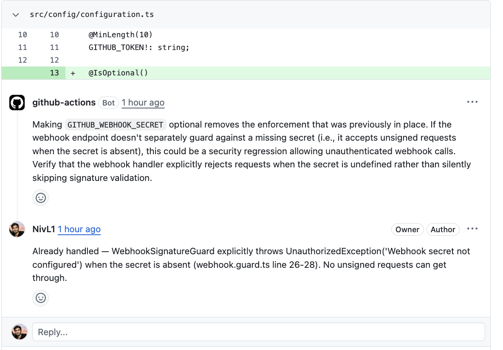

# AI PR Reviewer

> A NestJS service + GitHub Action that runs LLM-powered code review on pull requests. Designed as a small, production-shaped backend you can self-host — not just a wrapper script.

[](https://github.com/NivL1/ai-pr-reviewer/actions/workflows/ci.yml)
[](./LICENSE)
[](https://nodejs.org/)
[](https://nestjs.com/)
[](./Dockerfile)

---

## Why this exists

Most "AI PR review" tools are thin wrappers around an LLM call. This repo treats the same problem as a real backend service:

- **HMAC-validated webhook ingestion** so the service can be exposed to the public internet.
- **Provider-agnostic LLM layer** — swap Anthropic for OpenAI/local models behind one interface.
- **Idempotent review pipeline** that's safe to retry on a bad GitHub delivery.
- **Containerized** with a multi-stage Dockerfile and `docker-compose` for local dev.
- **Two run modes**: long-running NestJS service *or* one-shot GitHub Action.

It exists as a reference for how I structure small AI-powered backends in production.

## Architecture

```
                ┌──────────────────────────┐
   GitHub PR ──▶│  Webhook Controller      │  HMAC verify (X-Hub-Signature-256)
                │  (NestJS, /webhooks)     │
                └──────────┬───────────────┘
                           │ ReviewRequestedEvent
                           ▼
                ┌──────────────────────────┐
                │  Reviewer Service        │  fetch diff, chunk, dedupe
                │  (orchestrator)          │
                └──────────┬───────────────┘
                           │
              ┌────────────┼────────────┐
              ▼                         ▼
   ┌──────────────────┐       ┌──────────────────┐
   │  LLM Service     │       │  GitHub Service  │
   │  (Anthropic SDK) │       │  (Octokit)       │
   └──────────────────┘       └──────────────────┘
```

See [`docs/architecture.md`](./docs/architecture.md) for the long version and [`docs/runbook.md`](./docs/runbook.md) for setup and operations.

## Features

- Inline code review comments on changed lines (not just a top-level summary).
- Configurable rules per repo via `.ai-review.yml` (style, focus areas, ignored paths).
- Cost guardrails: max diff size, file allow/deny lists, model pinning.
- Skips generated files, lockfiles, and sourcemaps by default (configurable ignore patterns).
- Health and readiness endpoints suitable for Kubernetes probes.

### Example review comment



## Getting started

### Prerequisites

- Node.js 20+
- Docker (optional, for the container path)
- An Anthropic API key
- A GitHub App or PAT with `pull_requests:write` and `contents:read`

### Local development

```bash
git clone https://github.com/NivL1/ai-pr-reviewer.git
cd ai-pr-reviewer
cp .env.example .env        # fill in ANTHROPIC_API_KEY and GITHUB_WEBHOOK_SECRET
npm install
npm run start:dev
```

Then point a GitHub webhook at `http://<your-ngrok-host>/webhooks/github` with the same secret.

### Docker

```bash
docker compose up --build
```

### As a GitHub Action

Drop this into `.github/workflows/pr-review.yml` in any repo:

```yaml
name: AI PR Review
on:
  pull_request:
    types: [opened, synchronize, reopened]
jobs:
  review:
    runs-on: ubuntu-latest
    if: github.event.pull_request.draft == false
    permissions:
      pull-requests: write
    steps:
      - uses: actions/checkout@v4
      - name: Run AI review
        uses: NivL1/ai-pr-reviewer@master
        env:
          ANTHROPIC_API_KEY: ${{ secrets.ANTHROPIC_API_KEY }}
          GITHUB_TOKEN: ${{ secrets.GITHUB_TOKEN }}
          GITHUB_REPOSITORY: ${{ github.repository }}
          PR_NUMBER: ${{ github.event.pull_request.number }}
          GITHUB_SHA: ${{ github.event.pull_request.head.sha }}
```

Add `ANTHROPIC_API_KEY` to your repo's secrets (**Settings → Secrets and variables → Actions**) and you're done. See [`docs/runbook.md`](./docs/runbook.md) for the full setup guide.

## Configuration

| Env var | Required | Description |
|---|---|---|
| `ANTHROPIC_API_KEY` | yes | Anthropic API key used by the LLM client. |
| `GITHUB_TOKEN` | yes | Token used to fetch diffs and post comments. |
| `GITHUB_WEBHOOK_SECRET` | yes (service mode) | HMAC secret for webhook signature validation. |
| `LLM_MODEL` | no | Defaults to `claude-sonnet-4-6`. |
| `MAX_DIFF_LINES` | no | Cost guardrail. Defaults to `2000`. |
| `PORT` | no | HTTP port. Defaults to `3000`. |

Per-repo behavior is configured in `.ai-review.yml`:

```yaml
focus:
  - security
  - error handling
ignore:
  - "**/*.lock"
  - "dist/**"
max_comments_per_pr: 15
```

## Project layout

```
src/
├── main.ts
├── app.module.ts
├── config/             # env validation, typed config
├── github/             # webhook controller, signature guard, Octokit client
├── reviewer/           # diff parsing, chunking, orchestration
├── llm/                # provider-agnostic LLM client (Anthropic today)
└── health/             # liveness/readiness endpoints
test/                   # unit + e2e tests
.github/workflows/      # CI
action.yml              # GitHub Action manifest
Dockerfile              # multi-stage build
```

## Roadmap

- [x] Anthropic provider — first LLM implementation
- [ ] OpenAI provider behind the same interface
- [ ] Per-repo `.ai-review.yml` parsing
- [ ] Diff chunking with overlap for large PRs
- [ ] Web dashboard (read-only) showing review history
- [ ] Self-hostable Helm chart

## Contributing

PRs welcome. See [CONTRIBUTING.md](./CONTRIBUTING.md).

## License

MIT — see [LICENSE](./LICENSE).

---

Built by [Niv Lusky](https://github.com/NivL1) — Tech Lead @ HopOn.
